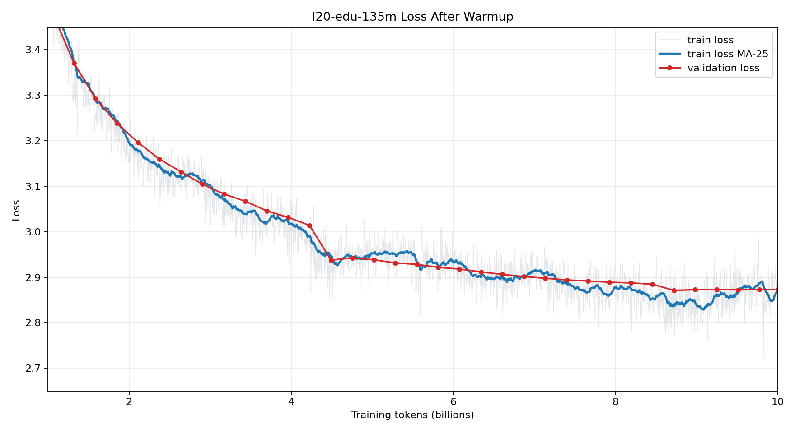
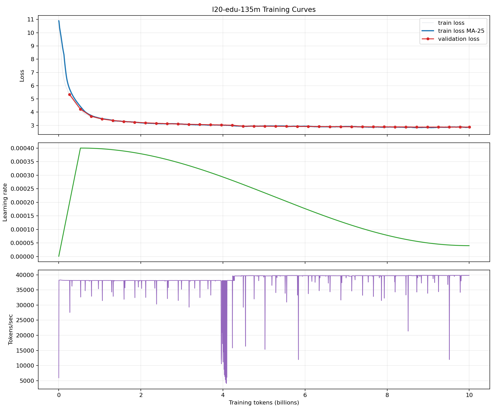

# l20-edu-135m-pretrain

From-scratch pretraining of a 134.5M-parameter Llama-style base language model on
10B FineWeb-Edu tokens using a single NVIDIA L20 GPU.

The released checkpoint is available on Hugging Face:
[`AliceYin/l20-edu-135m`](https://huggingface.co/AliceYin/l20-edu-135m).

This project is intentionally scoped as a reproducible small-model pretraining
run, not a general SOTA claim. The useful claim is narrower: a complete
single-GPU pretraining pipeline with public checkpoint, training config,
generation support, perplexity evaluation, and matched `lm-eval` comparisons
against public 100M-160M baselines.

## Result Summary

- Model: `l20-edu-135m`, 134,515,008 parameters
- Architecture: Llama-style decoder-only Transformer
- Tokenizer: `HuggingFaceTB/SmolLM2-135M`
- Dataset: `HuggingFaceFW/fineweb-edu`, `sample-10BT`
- Training budget: 10,001,252,352 planned tokens
- Hardware: one NVIDIA L20 GPU
- Final checkpoint: `runs/l20-edu-135m-deepthin/step-018928`
- Final validation: loss `2.8731`, perplexity `17.69`
- Public release: Hugging Face model repo with weights, tokenizer, config,
  training config, model card, and eval comparison files

Final zero-shot `lm-eval` results:

| Task | Metric | Score |
| --- | --- | ---: |
| ARC-Challenge | acc_norm | 0.2765 |
| ARC-Easy | acc_norm | 0.5059 |
| HellaSwag | acc_norm | 0.3272 |
| LAMBADA OpenAI | acc | 0.2540 |
| PIQA | acc_norm | 0.6224 |
| WinoGrande | acc | 0.5099 |

Against public baselines on the same task set, the model beats GPT-2 small on
5/6 tasks, OPT-125M on 4/6, GPT-Neo-125M on 4/6, Cerebras-GPT-111M on 6/6, and
Pythia-160M on 6/6. It does not beat SmolLM-135M or SmolLM2-135M, which were
trained with much larger token budgets.

See [docs/evaluation_report.md](docs/evaluation_report.md) for the full
comparison table, benchmark protocol, contamination status, and training-token
context. See [docs/training_recipe.md](docs/training_recipe.md) for the exact
training recipe.

## Benchmark Rigor

The public baseline comparison uses the same EleutherAI `lm-evaluation-harness`
version (`0.4.12`), task list, zero-shot setting, `bfloat16` dtype, `cuda:0`
device, auto batch policy, full task datasets, logged samples, and comparison
parser for both candidate and baselines. Baseline numbers are self-run through
`scripts/eval_public_baselines.sh`; they are not copied from public leaderboards.

The comparison is still not fully controlled: public baselines use their own
released tokenizers and model context configs. A strict architecture claim
requires the controlled baseline in `configs/l20_wide_140m_baseline.yaml`,
trained with the same tokenizer, FineWeb-Edu slice, context length, optimizer,
schedule, and token budget.

No full contamination pass is claimed for this release. The repository includes
`scripts/check_contamination.py` and `scripts/sample_training_text.py`, but a
separate audit against the benchmark samples is still needed before making a
strong no-contamination statement.

## Training Curves

The run logged 1,903 training points and 38 validation points. The full extracted
metrics are available in [docs/training_metrics.csv](docs/training_metrics.csv),
with a compact summary in [docs/training_summary.json](docs/training_summary.json).





## What This Demonstrates

- End-to-end base model pretraining from random initialization.
- Streaming data ingestion and token packing for FineWeb-Edu.
- Checkpointing, resume, generation, validation perplexity, and public eval.
- A documented training recipe: batch size, global batch, sequence length,
  optimizer, LR schedule, warmup, weight decay, gradient accumulation,
  checkpoint cadence, runtime estimate, and known run issues.
- A practical single-GPU recipe for 100M-class models.
- Clear release hygiene: model card, training budget disclosure, baseline
  context, and limitation statements.

## What This Does Not Claim

- This is not a chat model.
- This is not a general SOTA model.
- This is not a matched-token-budget win over SmolLM or SmolLM2.
- This is not evidence that the architecture is better until the controlled
  wide baseline is trained under the same data, tokenizer, optimizer, schedule,
  and token budget.

## Repository Layout

```text
configs/                      Training and evaluation configs
docs/                         Protocols, model card template, eval report
scripts/                      Training, evaluation, comparison, and release tools
src/l20_pretrain/             Model, data, training, generation, eval code
tests/                        Unit tests for config, data, model, eval parsing
```

Large artifacts such as checkpoints, raw eval outputs, logs, and datasets are
not committed to Git. The released model artifacts live on Hugging Face.

## Setup

```bash
python3 -m venv .venv
source .venv/bin/activate
pip install -e .
```

Install a PyTorch build that matches your CUDA runtime before `pip install -e .`
if the default install is not suitable for the target machine.

## Train

The completed run used:

```bash
python -m l20_pretrain.train configs/l20_135m_deepthin.yaml
```

Resume from a checkpoint:

```bash
python -m l20_pretrain.train configs/l20_135m_deepthin.yaml \
  --resume runs/l20-edu-135m-deepthin/step-010000
```

Generate from a checkpoint:

```bash
python -m l20_pretrain.generate runs/l20-edu-135m-deepthin/step-018928 \
  --prompt "The reason transformers use attention is" \
  --max-new-tokens 120
```

Evaluate perplexity:

```bash
python -m l20_pretrain.eval_ppl \
  runs/l20-edu-135m-deepthin/step-018928 \
  configs/l20_135m_deepthin.yaml
```

Run the base-model eval suite:

```bash
scripts/setup_eval_env.sh
scripts/eval_lm_harness.sh runs/l20-edu-135m-deepthin/step-018928
```

Run public baselines:

```bash
scripts/eval_public_baselines.sh
```

Compare results:

```bash
python scripts/compare_lm_eval.py \
  --candidate l20-edu-135m-deepthin=eval_results/l20-edu-135m-deepthin \
  --baseline gpt2-small=eval_results/gpt2-small \
  --baseline opt-125m=eval_results/opt-125m \
  --baseline gpt-neo-125m=eval_results/gpt-neo-125m \
  --baseline cerebras-gpt-111m=eval_results/cerebras-gpt-111m \
  --baseline pythia-160m=eval_results/pythia-160m \
  --baseline smollm-135m=eval_results/smollm-135m \
  --baseline smollm2-135m=eval_results/smollm2-135m
```

## Next Work

The cleanest next experiment is the controlled baseline:

```bash
python -m l20_pretrain.train configs/l20_wide_140m_baseline.yaml
```

That would test whether the deep-thin architecture is actually better under the
same tokenizer, data slice, context length, optimizer, schedule, and 10B-token
budget.

The most useful product-facing next step is supervised fine-tuning:

- create `l20-edu-135m-sft`
- use a small high-quality instruction dataset
- evaluate instruction following, factual QA, short writing, and format control
- publish it separately from the base model

## Sources

- FineWeb-Edu dataset card:
  https://huggingface.co/datasets/HuggingFaceFW/fineweb-edu
- SmolLM2-135M model card:
  https://huggingface.co/HuggingFaceTB/SmolLM2-135M
- EleutherAI lm-evaluation-harness:
  https://github.com/EleutherAI/lm-evaluation-harness
- Hugging Face model cards:
  https://huggingface.co/docs/hub/main/en/model-cards
