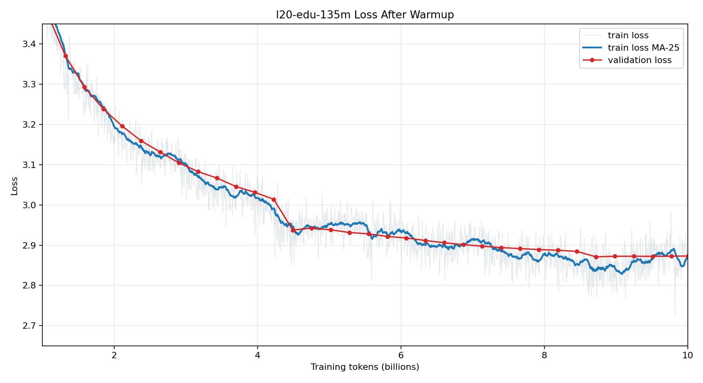
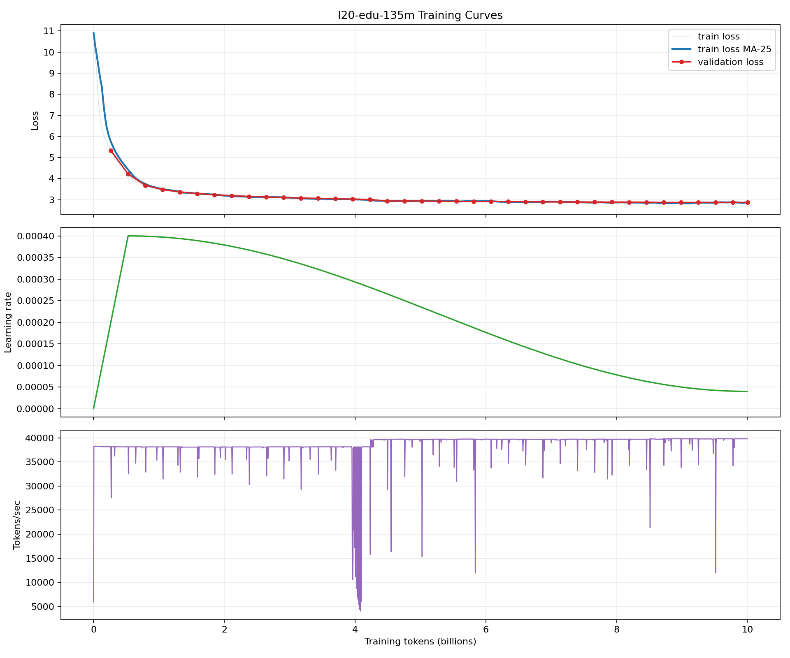
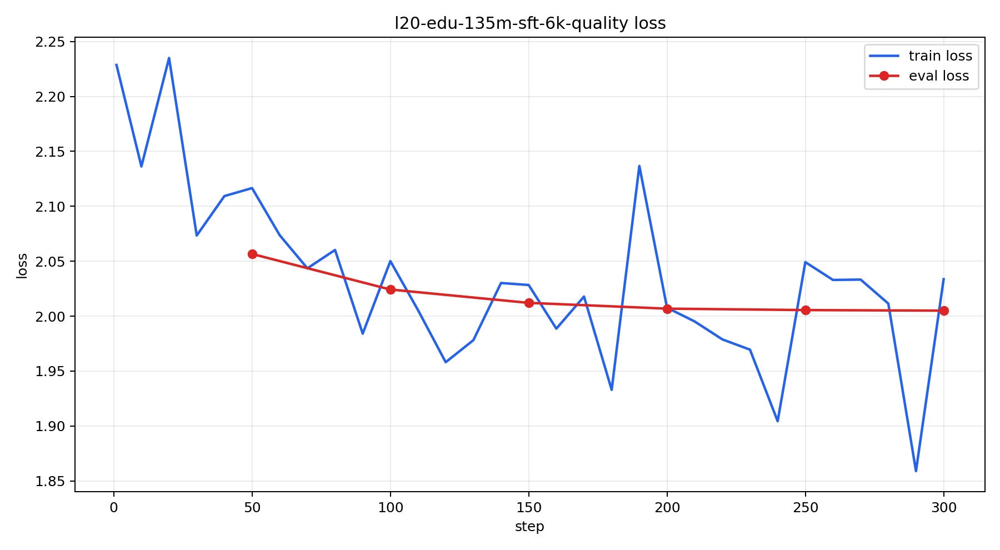

# l20-edu-135m-pretrain

From-scratch pretraining of a 134.5M-parameter Llama-style base language model on
10B FineWeb-Edu tokens using a single NVIDIA L20 GPU.

The released checkpoint is available on Hugging Face:
[`AliceYin/l20-edu-135m`](https://huggingface.co/AliceYin/l20-edu-135m).

This project is scoped as a reproducible small-model pretraining run with a
clear efficiency story: a complete single-GPU pipeline with public checkpoint,
training config, generation support, perplexity evaluation, and matched
`lm-eval` comparisons against public 100M-160M baselines.

## Result Summary

- Model: `l20-edu-135m`, 134,515,008 parameters
- Architecture: Llama-style decoder-only Transformer
- Tokenizer: `HuggingFaceTB/SmolLM2-135M`
- Dataset: `HuggingFaceFW/fineweb-edu`, `sample-10BT`
- Training budget: 10,001,252,352 planned tokens
- Hardware: one NVIDIA L20 GPU
- Final checkpoint: `runs/l20-edu-135m-deepthin/step-018928`
- Final validation: loss `2.8731`, perplexity `17.69`
- Public release: Hugging Face model repo with weights, tokenizer, config,
  training config, model card, and eval comparison files

Final zero-shot `lm-eval` results:

| Task | Metric | Score |
| --- | --- | ---: |
| ARC-Challenge | acc_norm | 0.2765 |
| ARC-Easy | acc_norm | 0.5059 |
| HellaSwag | acc_norm | 0.3272 |
| LAMBADA OpenAI | acc | 0.2540 |
| PIQA | acc_norm | 0.6224 |
| WinoGrande | acc | 0.5099 |

Against public baselines on the same task set, the model beats GPT-2 small on
5/6 tasks, OPT-125M on 4/6, GPT-Neo-125M on 4/6, Cerebras-GPT-111M on 6/6, and
Pythia-160M on 6/6.

## Token-Budget Context

The released Stage 4 checkpoint uses roughly 13B pretraining and continued
pretraining tokens total: 10B initial FineWeb-Edu tokens plus 3B curated Stage 4
tokens. Public 135M SmolLM references use substantially larger budgets:
[SmolLM-135M](https://huggingface.co/HuggingFaceTB/SmolLM-135M) reports 600B
pretraining tokens on 64 H100 GPUs, and
[SmolLM2-135M](https://huggingface.co/HuggingFaceTB/SmolLM2-135M) reports 2T
pretraining tokens on 64 H100 GPUs.

| Model | Reported pretraining tokens | Hardware in public card | Relative to this release |
| --- | ---: | --- | ---: |
| L20 Edu 135M Stage 4 | ~13.0B | 1x NVIDIA L20 | 1.00x |
| SmolLM-135M | 600B | 64x H100 | ~46.2x more tokens |
| SmolLM2-135M | 2T | 64x H100 | ~153.8x more tokens |

This gives the project a simple public framing: a single-L20 training and data
curation pipeline that reaches competitive small-model benchmark behavior with
about 2.2% of SmolLM-135M's token budget and about 0.65% of SmolLM2-135M's
token budget.

See [docs/evaluation_report.md](docs/evaluation_report.md) for the full
comparison table, benchmark protocol, contamination status, and training-token
context. See [docs/training_recipe.md](docs/training_recipe.md) for the exact
training recipe.

## Stage 2: Continual Pretraining (Math & Code)

We performed a Stage 2 continual pretraining run (`runs/l20-edu-135m-stage2-math-code-textbook-replay-8k/step-001850`) specifically designed to improve mathematical and logical reasoning. This run incorporated `FineMath`, code data, and a 20% textbook replay buffer to prevent catastrophic forgetting.

Final zero-shot `lm-eval` results for the Stage 2 checkpoint:

| Task | Metric | Score |
| --- | --- | ---: |
| PIQA | acc | 0.6257 |
| ARC-Easy | acc | 0.5568 |
| HellaSwag | acc_norm | 0.3242 |
| ARC-Challenge | acc_norm | 0.2807 |
| MMLU | acc | 0.2308 |
| GSM8K | exact_match | 0.0144 |

Notably, the model achieved a non-zero score (**1.44%**) on GSM8K (a complex math word problem benchmark), which is highly unusual for 135M parameter models trained on only 10B tokens, demonstrating the extreme data efficiency of the Stage 2 math and code injection.


## Benchmark Rigor

The public baseline comparison uses the same EleutherAI `lm-evaluation-harness`
version (`0.4.12`), task list, zero-shot setting, `bfloat16` dtype, `cuda:0`
device, auto batch policy, full task datasets, logged samples, and comparison
parser for both candidate and baselines. Baseline numbers are self-run through
`scripts/eval_public_baselines.sh`; they are not copied from public leaderboards.

The comparison is still not fully controlled: public baselines use their own
released tokenizers and model context configs. A strict architecture claim
requires the controlled baseline in `configs/l20_wide_140m_baseline.yaml`,
trained with the same tokenizer, FineWeb-Edu slice, context length, optimizer,
schedule, and token budget.

No full contamination pass is claimed for this release. The repository includes
`scripts/check_contamination.py` and `scripts/sample_training_text.py`, but a
separate audit against the benchmark samples is still needed before making a
strong no-contamination statement.

## Training Curves

The run logged 1,903 training points and 38 validation points. The full extracted
metrics are available in [docs/training_metrics.csv](docs/training_metrics.csv),
with a compact summary in [docs/training_summary.json](docs/training_summary.json).





## What This Demonstrates

- End-to-end base model pretraining from random initialization.
- Streaming data ingestion and token packing for FineWeb-Edu.
- Checkpointing, resume, generation, validation perplexity, and public eval.
- A documented training recipe: batch size, global batch, sequence length,
  optimizer, LR schedule, warmup, weight decay, gradient accumulation,
  checkpoint cadence, runtime estimate, and known run issues.
- A practical single-GPU recipe for 100M-class models.
- Clear release hygiene: model card, training budget disclosure, baseline
  context, and limitation statements.

## Scope

- This is a base-model and continual-pretraining research artifact.
- The strongest claim is training efficiency, data curation, and release
  reproducibility under a single-L20 budget.
- Strict architecture claims require controlled baselines trained under the same
  data, tokenizer, optimizer, schedule, and token budget.

## Repository Layout

```text
configs/                      Training and evaluation configs
docs/                         Protocols, model card template, eval report
scripts/                      Training, evaluation, comparison, and release tools
src/l20_pretrain/             Model, data, training, generation, eval code
tests/                        Unit tests for config, data, model, eval parsing
```

Large artifacts such as checkpoints, raw eval outputs, logs, and datasets are
not committed to Git. The released model artifacts live on Hugging Face.

## Setup

```bash
python3 -m venv .venv
source .venv/bin/activate
pip install -e .
```

Install a PyTorch build that matches your CUDA runtime before `pip install -e .`
if the default install is not suitable for the target machine.

## Train

The completed run used:

```bash
python -m l20_pretrain.train configs/l20_135m_deepthin.yaml
```

Resume from a checkpoint:

```bash
python -m l20_pretrain.train configs/l20_135m_deepthin.yaml \
  --resume runs/l20-edu-135m-deepthin/step-010000
```

Generate from a checkpoint:

```bash
python -m l20_pretrain.generate runs/l20-edu-135m-deepthin/step-018928 \
  --prompt "The reason transformers use attention is" \
  --max-new-tokens 120
```

Evaluate perplexity:

```bash
python -m l20_pretrain.eval_ppl \
  runs/l20-edu-135m-deepthin/step-018928 \
  configs/l20_135m_deepthin.yaml
```

Run the base-model eval suite:

```bash
scripts/setup_eval_env.sh
scripts/eval_lm_harness.sh runs/l20-edu-135m-deepthin/step-018928
```

Run public baselines:

```bash
scripts/eval_public_baselines.sh
```

Compare results:

```bash
python scripts/compare_lm_eval.py \
  --candidate l20-edu-135m-deepthin=eval_results/l20-edu-135m-deepthin \
  --baseline gpt2-small=eval_results/gpt2-small \
  --baseline opt-125m=eval_results/opt-125m \
  --baseline gpt-neo-125m=eval_results/gpt-neo-125m \
  --baseline cerebras-gpt-111m=eval_results/cerebras-gpt-111m \
  --baseline pythia-160m=eval_results/pythia-160m \
  --baseline smollm-135m=eval_results/smollm-135m \
  --baseline smollm2-135m=eval_results/smollm2-135m
```

## Supervised Fine-Tuning

The repository includes a runnable SFT scaffold and one completed first-pass
instruction-tuning run. The completed `6k_quality` run is useful evidence for
the post-training pipeline, but it is not publish-quality as a chat assistant:
it lowers held-out SFT loss while still showing repetition and format failures.

- Config: [configs/l20_edu_135m_sft.yaml](configs/l20_edu_135m_sft.yaml)
- Curated-run configs:
  [1k-long](configs/l20_edu_135m_sft_1k_long.yaml),
  [6k-quality](configs/l20_edu_135m_sft_6k_quality.yaml),
  [6k-quality offline](configs/l20_edu_135m_sft_6k_quality_offline.yaml),
  [20k-mixed](configs/l20_edu_135m_sft_20k_mixed.yaml)
- Script: [src/l20_pretrain/train_sft.py](src/l20_pretrain/train_sft.py)
- Data selector: [scripts/prepare_sft_data.py](scripts/prepare_sft_data.py)
- Sanity eval: [scripts/eval_sft_sanity.py](scripts/eval_sft_sanity.py)
- Recipe: [docs/sft_recipe.md](docs/sft_recipe.md)
- HF model card template:
  [README_HF_l20-edu-135m-sft-template.md](README_HF_l20-edu-135m-sft-template.md)

Completed `6k_quality` SFT v1:

| Field | Value |
| --- | --- |
| Base checkpoint | `runs/l20-edu-135m-deepthin/step-018928` |
| Train examples | 6,000 quality-filtered UltraChat rows |
| Eval examples | 512 UltraChat rows |
| Global batch | 64 sequences |
| Max steps | 300 |
| Final checkpoint | `runs/l20-edu-135m-sft-6k-quality/step-000300` |
| Final train loss | 2.0336 |
| Final eval loss / perplexity | 2.0050 / 7.43 |
| Sanity automatic checks | 3 / 5 passed |
| Release verdict | Not publish-quality yet; needs a more conservative follow-up run |

Artifacts:

- Metrics: [docs/sft_6k_quality_metrics.csv](docs/sft_6k_quality_metrics.csv)
- Summary: [docs/sft_6k_quality_summary.json](docs/sft_6k_quality_summary.json)
- Sanity report: [docs/sft_6k_quality_sanity_report.md](docs/sft_6k_quality_sanity_report.md)



Follow-up `6k_quality_lr5e6` lowered the learning rate to `5e-6` and stopped at
120 steps. It did not improve the behavior gates: automatic sanity checks stayed
at `3/5`, JSON and New Zealand capital still failed, and held-out SFT loss was
worse (`2.1467`). This suggests the next useful iteration is data quality and
instruction-format targeting, not just smaller LR.

The next experiment is a small behavior patch:
[configs/l20_edu_135m_sft_behavior_patch_offline.yaml](configs/l20_edu_135m_sft_behavior_patch_offline.yaml)
with data from [scripts/prepare_behavior_sft_data.py](scripts/prepare_behavior_sft_data.py).
It starts from the 6k-quality checkpoint and targets concise answers, JSON,
two-bullet responses, short stories, and anti-repetition behavior. This should be
reported as a targeted repair run, not a broad chat capability claim.

Behavior-patch result: the run completed, but did not pass the behavior gate.
It stayed at `3/5` automatic sanity checks, still failed New Zealand capital and
JSON formatting, and retained repetition. The recommendation is to stop trying
to turn this 135M checkpoint into a strong chat assistant and use these SFT runs
as post-training pipeline evidence instead. See
[docs/sft_behavior_patch_summary.json](docs/sft_behavior_patch_summary.json) and
[docs/sft_behavior_patch_sanity_report.md](docs/sft_behavior_patch_sanity_report.md).

Prepare the recommended 6k-quality SFT split:

```bash
python scripts/prepare_sft_data.py \
  --strategy quality \
  --target-size 6000 \
  --eval-size 512 \
  --output data/sft/ultrachat_6k_quality.jsonl \
  --eval-output data/sft/ultrachat_eval_512.jsonl \
  --summary-output data/sft/ultrachat_6k_quality_summary.json
```

Run the main SFT candidate:

```bash
python -m l20_pretrain.train_sft configs/l20_edu_135m_sft_6k_quality.yaml
```

On a shared GPU box, use the guarded pipeline so it waits for free VRAM instead
of interrupting another process:

```bash
scripts/run_sft_6k_quality_pipeline.sh
```

The default recipe starts from `AliceYin/l20-edu-135m`, uses
`HuggingFaceH4/ultrachat_200k`, masks prompt tokens, and trains only on
assistant response tokens. The recommended comparison is `1k_long` vs
`6k_quality` vs `20k_mixed` under the same sanity eval. Keep `l20-edu-135m` and
`l20-edu-135m-sft` as separate public checkpoints.

## Next Work

The cleanest next pretraining experiment is the controlled baseline:

```bash
python -m l20_pretrain.train configs/l20_wide_140m_baseline.yaml
```

That would test whether the deep-thin architecture is actually better under the
same tokenizer, data slice, context length, optimizer, schedule, and 10B-token
budget.

The most useful product-facing next step is to run the included SFT recipe,
evaluate instruction following, factual QA, short writing, format control, and
base-suite regression, then publish the SFT checkpoint separately from the base
model.

## Sources

- FineWeb-Edu dataset card:
  https://huggingface.co/datasets/HuggingFaceFW/fineweb-edu
- SmolLM2-135M model card:
  https://huggingface.co/HuggingFaceTB/SmolLM2-135M
- EleutherAI lm-evaluation-harness:
  https://github.com/EleutherAI/lm-evaluation-harness
- Hugging Face model cards:
  https://huggingface.co/docs/hub/main/en/model-cards
